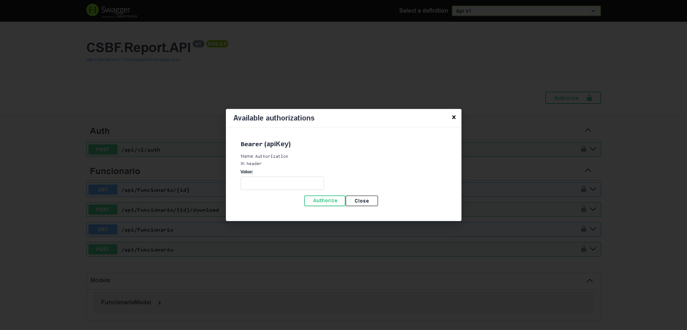

  API REST protegida por JWT(JSON Web Token), conectada a um banco de dados SQL Server, com suporte a documentação/testes via Swagger, e utilizando um repositório para abstrair as operações de dados.

  Pode a qualquer momento ser usada como backend e ser consumida por uma aplicação FrontEnd que precisa autenticar usuários e acessar dados de funcionários, por exemplo.

 
 

<h1>Swagger UI</h1>

  

 

<h1>JWT em ação solicitando o código do Token para liberção</h1>

  

